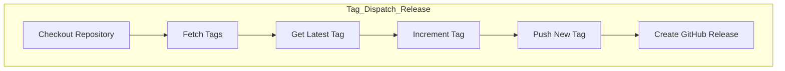
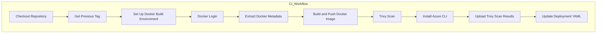
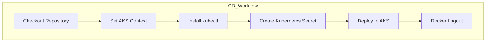

# GitHub Action for Tag Release, CI and CD
Contains GitHub-action workflows to manage Tag releases, Continous integration and Continuous deployment.

***
### *_Quick flow snippet_*:

#### Dispatch & Release

1. 🏷️ **Navigate to the "Actions" tab in your GitHub repository.**
2. 🖱️ **Select the "Tag Dispatch & Release" workflow.**
3. 📝 **Provide the required inputs (target branch and version type).**
4. ✅ **Click "Run workflow" to start the tag dispatch & release process.**

#### CI and CD 

5.  🚀 **These workflows are automatically triggered based on the tag release and completion of previous workflows.**

***

## Workflow description

### 1.Tag Dispatch & Release Workflow

This workflow is responsible for fetching the latest tag, incrementing the tag based on the selected branch env ( uat, prod) and version type (major, minor, patch), and then pushing the new tag to the repository. This workflow is manually triggered.

**File:** `.github/workflows/dispatch.yml`

**Trigger:** `Manual (workflow_dispatch)`

#### Inputs:

- **Branch:** The target branch to push the tag (`uat`, `prod`).
- **Version_type:** The type of version increment (`major`, `minor`, `patch`).

#### Steps:

### 2. CI Workflow 
This workflow is triggered when a new release is published with the tag pattern `uat_v*`, `v*`. It performs the following tasks:

**File:** `.github/workflows/infra-be-ci-[Env].yml`

**Trigger:** `Release published (release.published)`

#### Steps:

### 3. CD Workflow 
This workflow is triggered after the successful completion of the CI workflow. It deploys the new image to the Azure Kubernetes Service (AKS) cluster.

**File:** `.github/workflows/infra-be-cd-[Env].yml`

**Trigger:** `Workflow run completed - infra-be-ci-[Env]`

#### Steps:

